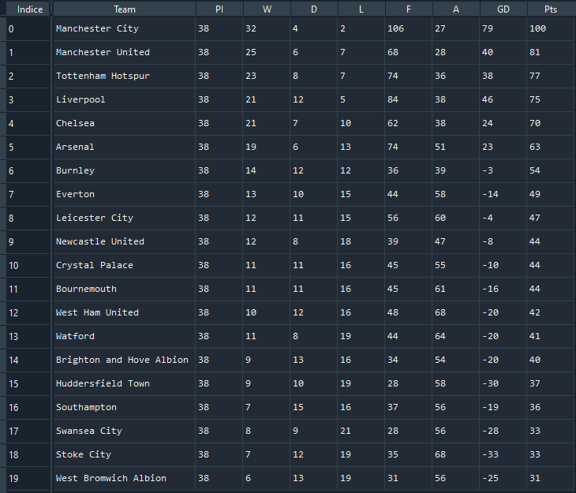

# skysports_scraper

## Presentation

This project is part of the #66daysofdata initiative started by Ken Jee.
During this Journey I learnt some techniques of web scraping using BeautifulSoup. So I decided to put these new knowledges into practice !
This is a scraper for the web site SkySports. Especially for the premier-league-table pages.

## Summary

The goal of this scraper is to get all the data contained in the main table:
* Team
* PI : pass interference
* W : number of matches won
* D : number of draws
* L : numberof matches lost
* F : number of goal scored
* A : number of goal conceded
* GD : difference between A and F (F - A)
* Pts : +1 for tie, +3 for win, +0 for loss

## Code and Resources Used

**Python Version:** 3.7\
**Packages:** BeautifulSoup4, requests, pandas

## Uses

This is a module, so if you need to use it, you only need to import skysport_scraper_module, and call its function

### Current fonctions

* scrap_page(url) : use the input url to scrap the page. Gives a pandas DataFrame as an output.\

